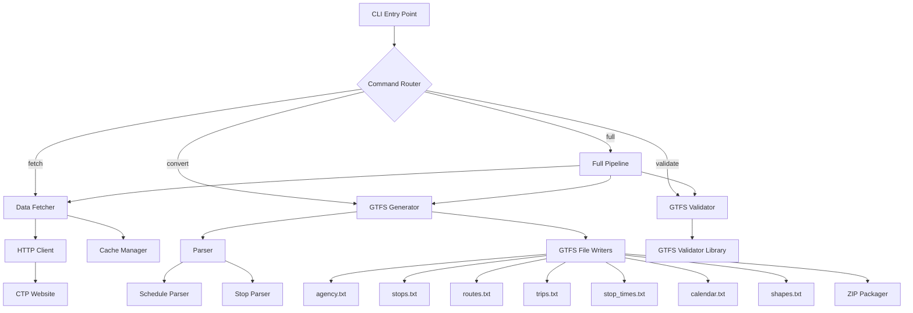

# Design Document: Cluj Bus GTFS Converter

## Overview

The Cluj Bus GTFS Converter is a standalone TypeScript/Node.js CLI tool that automates the process of fetching bus schedules from the CTP Cluj-Napoca website, parsing the schedule data, and generating a standards-compliant GTFS (General Transit Feed Specification) feed. The tool is designed to run both manually and as part of automated workflows (e.g., GitHub Actions, cron jobs) to maintain up-to-date transit data for consumption by transit routing applications like Tranzy.ai.

The system follows a pipeline architecture with four main stages:
1. **Data Fetching**: Scrape schedule data from ctpcj.ro
2. **Data Parsing**: Extract structured information from HTML/PDF sources
3. **GTFS Generation**: Convert parsed data into GTFS format files
4. **Validation**: Ensure GTFS feed compliance with the specification

## Architecture

### High-Level Architecture



### Technology Stack

- **Runtime**: Node.js 18+
- **Language**: TypeScript 5.x
- **CLI Framework**: Commander.js (command-line interface)
- **HTTP Client**: Axios (web scraping)
- **HTML Parsing**: Cheerio (jQuery-like HTML parsing)
- **PDF Parsing**: pdf-parse (PDF text extraction)
- **Geocoding**: OpenStreetMap Nominatim API (free, no API key required)
- **File System**: fs-extra (enhanced file operations)
- **Compression**: archiver (ZIP file creation)
- **Validation**: gtfs-validator (GTFS feed validation)
- **Logging**: Winston (structured logging)
- **Configuration**: dotenv + config files (JSON/YAML)
- **Testing**: Vitest (unit and integration tests)

### Project Structure

```
cluj-bus-gtfs-converter/
├── src/
│   ├── cli/
│   │   ├── index.ts              # CLI entry point
│   │   ├── commands/
│   │   │   ├── fetch.ts          # Fetch command
│   │   │   ├── convert.ts        # Convert command
│   │   │   ├── validate.ts       # Validate command
│   │   │   └── full.ts           # Full pipeline command
│   │   └── config.ts             # Configuration loader
│   ├── fetcher/
│   │   ├── DataFetcher.ts        # Main fetcher class
│   │   ├── HttpClient.ts         # HTTP client wrapper
│   │   └── CacheManager.ts       # Cache management
│   ├── parser/
│   │   ├── ScheduleParser.ts     # Schedule parsing orchestrator
│   │   ├── HtmlParser.ts         # HTML schedule parser
│   │   ├── PdfParser.ts          # PDF schedule parser
│   │   └── StopNormalizer.ts     # Stop name normalization
│   ├── generator/
│   │   ├── GtfsGenerator.ts      # Main GTFS generator
│   │   ├── writers/
│   │   │   ├── AgencyWriter.ts
│   │   │   ├── StopsWriter.ts
│   │   │   ├── RoutesWriter.ts
│   │   │   ├── TripsWriter.ts
│   │   │   ├── StopTimesWriter.ts
│   │   │   ├── CalendarWriter.ts
│   │   │   └── ShapesWriter.ts
│   │   ├── Geocoder.ts           # Geocoding service
│   │   └── ZipPackager.ts        # GTFS ZIP creation
│   ├── validator/
│   │   └── GtfsValidator.ts      # GTFS validation
│   ├── types/
│   │   ├── schedule.ts           # Schedule data types
│   │   ├── gtfs.ts               # GTFS data types
│   │   └── config.ts             # Configuration types
│   └── utils/
│       ├── logger.ts             # Logging utility
│       └── errors.ts             # Custom error classes
├── tests/
│   ├── unit/
│   └── integration/
├── config/
│   └── default.json              # Default configuration
├── cache/                        # Cached schedule data
├── output/                       # Generated GTFS files
└── package.json
```

## Components and Interfaces

### 1. CLI Layer

#### CLI Entry Point (`src/cli/index.ts`)

```typescript
interface CliOptions {
  output?: string;
  cache?: string;
  logLevel?: 'error' | 'warn' | 'info' | 'debug';
  config?: string;
}

class ClujGtfsCli {
  constructor(options: CliOptions);
  run(args: string[]): Promise<number>;
}
```

#### Command Interface

```typescript
interface Command {
  name: string;
  description: string;
  execute(options: CommandOptions): Promise<void>;
}

interface CommandOptions {
  output: string;
  cache: string;
  logLevel: string;
  config: Config;
}
```

### 2. Data Fetcher

#### DataFetcher (`src/fetcher/DataFetcher.ts`)

```typescript
interface RouteInfo {
  routeNumber: string;
  routeName: string;
  endpoints: string;
  scheduleUrl: string;
}

interface FetchResult {
  routes: RouteInfo[];
  schedules: Map<string, ScheduleData>;
  timestamp: Date;
}

class DataFetcher {
  constructor(
    private httpClient: HttpClient,
    private cacheManager: CacheManager
  );
  
  async fetchRouteList(): Promise<RouteInfo[]>;
  async fetchScheduleForRoute(route: RouteInfo): Promise<ScheduleData>;
  async fetchAll(): Promise<FetchResult>;
}
```

#### HttpClient (`src/fetcher/HttpClient.ts`)

```typescript
interface HttpClientConfig {
  baseUrl: string;
  timeout: number;
  retries: number;
  userAgent: string;
}

class HttpClient {
  constructor(config: HttpClientConfig);
  
  async get(url: string): Promise<string>;
  async downloadFile(url: string, destination: string): Promise<void>;
}
```

#### CacheManager (`src/fetcher/CacheManager.ts`)

```typescript
interface CacheEntry {
  data: any;
  timestamp: Date;
  version: string;
}

class CacheManager {
  constructor(private cacheDir: string);
  
  async get<T>(key: string): Promise<T | null>;
  async set<T>(key: string, data: T): Promise<void>;
  async has(key: string): Promise<boolean>;
  async clear(): Promise<void>;
  async getMetadata(key: string): Promise<CacheMetadata | null>;
}
```

### 3. Parser

#### ScheduleParser (`src/parser/ScheduleParser.ts`)

```typescript
interface ScheduleData {
  routeNumber: string;
  direction: 'outbound' | 'inbound';
  stops: StopInfo[];
  trips: TripInfo[];
  servicePattern: ServicePattern;
}

interface StopInfo {
  name: string;
  sequence: number;
  normalizedName: string;
}

interface TripInfo {
  tripId: string;
  headsign: string;
  stopTimes: StopTime[];
  serviceId: string;
}

interface StopTime {
  stopSequence: number;
  arrivalTime: string;  // HH:MM:SS format
  departureTime: string;
}

interface ServicePattern {
  weekday: boolean;
  saturday: boolean;
  sunday: boolean;
}

class ScheduleParser {
  constructor(
    private htmlParser: HtmlParser,
    private pdfParser: PdfParser,
    private stopNormalizer: StopNormalizer
  );
  
  async parse(content: string, format: 'html' | 'pdf'): Promise<ScheduleData>;
}
```

#### HtmlParser (`src/parser/HtmlParser.ts`)

```typescript
class HtmlParser {
  parseScheduleTable(html: string): ScheduleData;
  extractStops(html: string): StopInfo[];
  extractTimes(html: string): TripInfo[];
}
```

#### PdfParser (`src/parser/PdfParser.ts`)

```typescript
class PdfParser {
  async parseSchedule(pdfBuffer: Buffer): Promise<ScheduleData>;
  private extractText(pdfBuffer: Buffer): Promise<string>;
  private parseScheduleText(text: string): ScheduleData;
}
```

#### StopNormalizer (`src/parser/StopNormalizer.ts`)

```typescript
class StopNormalizer {
  normalize(stopName: string): string;
  deduplicateStops(stops: StopInfo[]): StopInfo[];
}
```

### 4. GTFS Generator

#### GtfsGenerator (`src/generator/GtfsGenerator.ts`)

```typescript
interface GtfsGenerationOptions {
  outputDir: string;
  startDate: Date;
  endDate: Date;
  agencyInfo: AgencyInfo;
}

interface AgencyInfo {
  id: string;
  name: string;
  url: string;
  timezone: string;
  lang: string;
  phone?: string;
}

class GtfsGenerator {
  constructor(
    private writers: GtfsWriters,
    private geocoder: Geocoder,
    private zipPackager: ZipPackager
  );
  
  async generate(
    schedules: Map<string, ScheduleData>,
    options: GtfsGenerationOptions
  ): Promise<string>;  // Returns path to gtfs.zip
}
```

#### GTFS Writers

Each writer follows a similar interface:

```typescript
interface GtfsWriter<T> {
  write(data: T[], outputPath: string): Promise<void>;
}

// Example: StopsWriter
interface GtfsStop {
  stop_id: string;
  stop_name: string;
  stop_lat: number;
  stop_lon: number;
  stop_code?: string;
}

class StopsWriter implements GtfsWriter<GtfsStop> {
  async write(stops: GtfsStop[], outputPath: string): Promise<void>;
}
```

#### Geocoder (`src/generator/Geocoder.ts`)

```typescript
interface GeocodingResult {
  lat: number;
  lon: number;
  displayName: string;
}

class Geocoder {
  constructor(private cacheManager: CacheManager);
  
  async geocode(
    stopName: string,
    city: string = 'Cluj-Napoca'
  ): Promise<GeocodingResult>;
  
  async geocodeBatch(
    stopNames: string[]
  ): Promise<Map<string, GeocodingResult>>;
}
```

#### ZipPackager (`src/generator/ZipPackager.ts`)

```typescript
class ZipPackager {
  async createGtfsZip(
    filesDir: string,
    outputPath: string
  ): Promise<void>;
}
```

### 5. Validator

#### GtfsValidator (`src/validator/GtfsValidator.ts`)

```typescript
interface ValidationResult {
  valid: boolean;
  errors: ValidationError[];
  warnings: ValidationWarning[];
}

interface ValidationError {
  file: string;
  line?: number;
  field?: string;
  message: string;
}

interface ValidationWarning {
  file: string;
  message: string;
}

class GtfsValidator {
  async validate(gtfsZipPath: string): Promise<ValidationResult>;
  private validateRequiredFiles(files: string[]): ValidationError[];
  private validateReferentialIntegrity(data: GtfsData): ValidationError[];
  private validateDataFormats(data: GtfsData): ValidationError[];
}
```

## Data Models

### Internal Schedule Representation

```typescript
interface ParsedSchedule {
  routes: Route[];
  stops: Stop[];
  trips: Trip[];
  stopTimes: StopTime[];
  calendar: Calendar[];
}

interface Route {
  id: string;
  shortName: string;
  longName: string;
  type: number;  // 3 for bus
}

interface Stop {
  id: string;
  name: string;
  lat: number;
  lon: number;
}

interface Trip {
  id: string;
  routeId: string;
  serviceId: string;
  headsign: string;
  directionId: number;
}

interface StopTime {
  tripId: string;
  stopId: string;
  stopSequence: number;
  arrivalTime: string;
  departureTime: string;
}

interface Calendar {
  serviceId: string;
  monday: boolean;
  tuesday: boolean;
  wednesday: boolean;
  thursday: boolean;
  friday: boolean;
  saturday: boolean;
  sunday: boolean;
  startDate: string;  // YYYYMMDD
  endDate: string;    // YYYYMMDD
}
```

### GTFS File Formats

The GTFS files follow the official specification. Key files:

**agency.txt**
```csv
agency_id,agency_name,agency_url,agency_timezone,agency_lang
CTP,CTP Cluj-Napoca,https://ctpcj.ro,Europe/Bucharest,ro
```

**stops.txt**
```csv
stop_id,stop_name,stop_lat,stop_lon
1,Piața Unirii,46.7712,23.5903
2,Piața Mărăști,46.7693,23.5985
```

**routes.txt**
```csv
route_id,agency_id,route_short_name,route_long_name,route_type
1,CTP,1,Mănăștur - Zorilor,3
```

**trips.txt**
```csv
route_id,service_id,trip_id,trip_headsign,direction_id
1,weekday,1_1_0,Zorilor,0
1,weekday,1_1_1,Mănăștur,1
```

**stop_times.txt**
```csv
trip_id,arrival_time,departure_time,stop_id,stop_sequence
1_1_0,06:00:00,06:00:00,1,1
1_1_0,06:05:00,06:05:00,2,2
```

**calendar.txt**
```csv
service_id,monday,tuesday,wednesday,thursday,friday,saturday,sunday,start_date,end_date
weekday,1,1,1,1,1,0,0,20250101,20250331
saturday,0,0,0,0,0,1,0,20250101,20250331
sunday,0,0,0,0,0,0,1,20250101,20250331
```

**shapes.txt** (optional)
```csv
shape_id,shape_pt_lat,shape_pt_lon,shape_pt_sequence
1_shape,46.7712,23.5903,1
1_shape,46.7693,23.5985,2
```


## Correctness Properties

*A property is a characteristic or behavior that should hold true across all valid executions of a system—essentially, a formal statement about what the system should do. Properties serve as the bridge between human-readable specifications and machine-verifiable correctness guarantees.*


### Property 1: Data Fetching Completeness
*For any* successful fetch operation, all route information (route number, name, endpoints, schedule URL) SHALL be retrieved and stored in the cache.
**Validates: Requirements 1.1, 1.2, 1.3, 1.5**

### Property 2: Schedule Parsing Completeness
*For any* schedule data in HTML or PDF format, the parser SHALL extract all stop names, stop sequences, arrival times, and service patterns without data loss.
**Validates: Requirements 2.1, 2.2, 2.3**

### Property 3: Stop Name Normalization Consistency
*For any* set of stop names with variations (e.g., "Piata Unirii", "Piața Unirii", "P-ta Unirii"), the normalizer SHALL produce the same normalized name, ensuring consistent stop identification across routes.
**Validates: Requirements 2.4**

### Property 4: GTFS Required Files Generation
*For any* GTFS generation operation, all required files (agency.txt, stops.txt, routes.txt, trips.txt, stop_times.txt, calendar.txt) SHALL be created with valid UTF-8 encoding.
**Validates: Requirements 3.1, 4.1, 5.1, 6.1, 7.1, 8.1, 10.4**

### Property 5: GTFS Field Completeness
*For any* GTFS file, all required fields as specified by the GTFS specification SHALL be present for every record.
**Validates: Requirements 3.2, 4.2, 5.2, 6.2, 7.2, 8.2, 9.2**

### Property 6: Geocoding Fallback
*For any* stop without coordinates in the source data, the geocoder SHALL obtain coordinates using the stop name and Cluj-Napoca context, ensuring all stops have valid latitude and longitude values.
**Validates: Requirements 4.3**

### Property 7: Unique Identifier Assignment
*For any* GTFS entity (stops, routes, trips), the generator SHALL assign unique IDs such that no two distinct entities share the same ID within their respective files.
**Validates: Requirements 4.4, 6.3**

### Property 8: Stop Deduplication
*For any* set of stops with identical normalized names, the generator SHALL assign the same stop_id, ensuring stops are not duplicated across routes.
**Validates: Requirements 4.5**

### Property 9: Route Type Consistency
*For all* routes in routes.txt, the route_type field SHALL be set to 3 (bus service), reflecting that all CTP Cluj services are bus-based.
**Validates: Requirements 5.3**

### Property 10: Route Naming Completeness
*For any* route, both route_short_name (route number) and route_long_name (endpoints) SHALL be populated with non-empty values derived from the source data.
**Validates: Requirements 5.4, 5.5**

### Property 11: Trip Headsign Presence
*For any* trip in trips.txt, the trip_headsign field SHALL contain a non-empty value indicating the destination or direction.
**Validates: Requirements 6.4**

### Property 12: Direction ID Conditional Inclusion
*For any* trip where direction information is available in the source data, the direction_id field SHALL be included with value 0 or 1.
**Validates: Requirements 6.5**

### Property 13: Stop Sequence Ordering
*For any* trip, stop_sequence values in stop_times.txt SHALL start at 1 for the first stop and increment sequentially for subsequent stops.
**Validates: Requirements 7.3**

### Property 14: Time Format Compliance
*For all* arrival_time and departure_time values in stop_times.txt, the format SHALL match HH:MM:SS (or H:MM:SS), with values ≥ 24:00:00 allowed for trips continuing past midnight.
**Validates: Requirements 7.4**

### Property 15: Service Pattern Distinctness
*For any* GTFS feed, distinct service patterns (weekday, Saturday, Sunday) SHALL have unique service_id values in calendar.txt.
**Validates: Requirements 8.3**

### Property 16: Calendar Date Range
*For any* generated GTFS feed, the start_date in calendar.txt SHALL be the generation date, and end_date SHALL be exactly 90 days later.
**Validates: Requirements 8.4, 8.5**

### Property 17: Shape Generation Fallback
*For any* route without explicit path data, the generator SHALL create an approximate shape by connecting stop coordinates in sequence order.
**Validates: Requirements 9.3**

### Property 18: Shape Referential Integrity
*For any* shape_id referenced in trips.txt, a corresponding shape SHALL exist in shapes.txt with at least two shape points.
**Validates: Requirements 9.4**

### Property 19: GTFS ZIP Packaging
*For any* successful GTFS generation, a gtfs.zip file SHALL be created containing all required files (agency.txt, stops.txt, routes.txt, trips.txt, stop_times.txt, calendar.txt) and optional files (shapes.txt if generated), saved to the configured output directory.
**Validates: Requirements 10.1, 10.2, 10.3, 10.5**

### Property 20: Validation File Presence Check
*For any* GTFS feed validation, the validator SHALL verify that all required files (agency.txt, stops.txt, routes.txt, trips.txt, stop_times.txt, calendar.txt or calendar_dates.txt) are present in the archive.
**Validates: Requirements 11.1**

### Property 21: Validation Field Presence Check
*For any* GTFS file validation, the validator SHALL verify that all required fields for that file type are present in the header row.
**Validates: Requirements 11.2**

### Property 22: Validation Referential Integrity Check
*For any* GTFS feed validation, the validator SHALL verify that all foreign key references (e.g., route_id in trips.txt exists in routes.txt, stop_id in stop_times.txt exists in stops.txt) are valid.
**Validates: Requirements 11.3**

### Property 23: Validation Format Compliance Check
*For any* GTFS feed validation, the validator SHALL verify that all data values comply with their specified formats (time formats, coordinate ranges, date formats, enum values).
**Validates: Requirements 11.4**

### Property 24: Validation Error Reporting
*For any* validation that finds errors, the validator SHALL produce a report containing file names, line numbers (where applicable), field names (where applicable), and descriptive error messages.
**Validates: Requirements 11.5**

### Property 25: Validation Warning Handling
*For any* validation that finds only warnings (no errors), the validator SHALL output the warnings but return a success status, allowing the feed to be published.
**Validates: Requirements 11.6**

### Property 26: CLI Full Command Sequencing
*For any* execution of the "full" command, the CLI SHALL execute fetch, convert, and validate operations in sequence, stopping if any step fails.
**Validates: Requirements 12.4**

### Property 27: CLI Exit Code Correctness
*For any* CLI command execution, the exit code SHALL be 0 if the command succeeds and non-zero if the command fails.
**Validates: Requirements 12.6**

### Property 28: CLI Output Directory Configuration
*For any* CLI command that generates files, the --output option SHALL control where files are written, overriding the default output directory.
**Validates: Requirements 12.7**

### Property 29: CLI Cache Directory Configuration
*For any* CLI command that uses caching, the --cache option SHALL control where cached data is stored, overriding the default cache directory.
**Validates: Requirements 12.8**

### Property 30: Schedule Change Detection
*For any* fetch operation, if the retrieved schedule data differs from the cached data, the tool SHALL log which routes have changed and proceed with regeneration; if data is unchanged, regeneration SHALL be skipped.
**Validates: Requirements 13.1, 13.2, 13.3**

### Property 31: Fetch Metadata Storage
*For any* successful fetch operation, metadata including timestamp and data version SHALL be stored alongside the cached data.
**Validates: Requirements 13.4**

### Property 32: Error Logging Completeness
*For any* error encountered during execution, the log SHALL include timestamp, component name, and error details.
**Validates: Requirements 14.1**

### Property 33: Log Level Configuration
*For any* CLI execution, the log level (error, warning, info, debug) SHALL be configurable via --log-level option or LOG_LEVEL environment variable, controlling which messages are output.
**Validates: Requirements 14.2**

### Property 34: Automated Mode File Logging
*For any* execution in automated mode (detected by absence of TTY or explicit flag), logs SHALL be written to both console and a log file.
**Validates: Requirements 14.3**

### Property 35: Multi-Source Configuration Support
*For any* configuration parameter, the tool SHALL accept values from config file, environment variables, and command-line arguments, with CLI args taking precedence over env vars, which take precedence over config file.
**Validates: Requirements 15.1, 15.2, 15.3, 15.4**

### Property 36: Configuration Completeness
*For any* valid configuration, all required parameters (CTP website URL, output directory, cache directory, geocoding API settings, log level) SHALL be defined either through defaults or user-provided values.
**Validates: Requirements 15.5**


## Error Handling

### Error Classification

The system defines four categories of errors:

1. **Network Errors**: Connection failures, timeouts, HTTP errors
2. **Parsing Errors**: Invalid HTML/PDF structure, missing expected data
3. **Validation Errors**: GTFS specification violations
4. **System Errors**: File system errors, insufficient permissions, out of memory

### Error Handling Strategy

#### Network Errors

```typescript
class NetworkError extends Error {
  constructor(
    public url: string,
    public statusCode?: number,
    message?: string
  ) {
    super(message || `Network error accessing ${url}`);
  }
}
```

**Handling**:
- Retry up to 3 times with exponential backoff (1s, 2s, 4s)
- Log each retry attempt
- If all retries fail, exit with descriptive error message and exit code 1
- Cache any partial results before failing

#### Parsing Errors

```typescript
class ParsingError extends Error {
  constructor(
    public routeId: string,
    public format: 'html' | 'pdf',
    message: string
  ) {
    super(`Failed to parse ${format} for route ${routeId}: ${message}`);
  }
}
```

**Handling**:
- Log the specific route and error details
- Continue processing other routes (fail gracefully)
- Include parsing errors in final summary
- If all routes fail to parse, exit with error code 2

#### Validation Errors

```typescript
class ValidationError extends Error {
  constructor(
    public file: string,
    public line?: number,
    public field?: string,
    message: string
  ) {
    super(message);
  }
}
```

**Handling**:
- Collect all validation errors before reporting
- Generate detailed error report with file, line, field information
- Exit with error code 3 if errors found
- Allow warnings to pass (exit code 0)

#### System Errors

```typescript
class SystemError extends Error {
  constructor(
    public operation: string,
    public path?: string,
    message: string
  ) {
    super(`System error during ${operation}: ${message}`);
  }
}
```

**Handling**:
- Log error with full context
- Clean up any partial files
- Exit immediately with error code 4
- No retries for system errors

### Graceful Degradation

The system implements graceful degradation for non-critical failures:

1. **Missing Coordinates**: Use geocoding service as fallback
2. **Missing Route Path**: Generate approximate path from stop coordinates
3. **Partial Schedule Data**: Process available data, log missing information
4. **Single Route Failure**: Continue processing other routes

### Logging Strategy

All errors are logged with:
- Timestamp (ISO 8601 format)
- Log level (ERROR, WARN, INFO, DEBUG)
- Component name (e.g., "DataFetcher", "ScheduleParser")
- Error message and stack trace (for ERROR level)
- Contextual information (route ID, file name, etc.)

Example log entry:
```
2025-01-15T10:30:45.123Z [ERROR] ScheduleParser: Failed to parse HTML for route 24: Table structure not found
  Route ID: 24
  URL: https://ctpcj.ro/index.php/ro/orare-linii/24
  Stack: ParsingError: Table structure not found
    at HtmlParser.parseScheduleTable (src/parser/HtmlParser.ts:45)
    ...
```

## Testing Strategy

### Testing Approach

The testing strategy employs both unit tests and property-based tests to ensure comprehensive coverage:

- **Unit Tests**: Verify specific examples, edge cases, and error conditions
- **Property Tests**: Verify universal properties across all inputs using randomized test data

Both testing approaches are complementary and necessary for comprehensive coverage. Unit tests catch concrete bugs in specific scenarios, while property tests verify general correctness across a wide range of inputs.

### Property-Based Testing Configuration

- **Library**: fast-check (TypeScript property-based testing library)
- **Iterations**: Minimum 100 runs per property test
- **Tagging**: Each property test references its design document property

Tag format:
```typescript
// Feature: cluj-bus-gtfs-converter, Property 7: Unique Identifier Assignment
```

### Test Organization

```
tests/
├── unit/
│   ├── fetcher/
│   │   ├── DataFetcher.test.ts
│   │   ├── HttpClient.test.ts
│   │   └── CacheManager.test.ts
│   ├── parser/
│   │   ├── HtmlParser.test.ts
│   │   ├── PdfParser.test.ts
│   │   └── StopNormalizer.test.ts
│   ├── generator/
│   │   ├── GtfsGenerator.test.ts
│   │   ├── Geocoder.test.ts
│   │   └── writers/
│   │       ├── StopsWriter.test.ts
│   │       ├── RoutesWriter.test.ts
│   │       └── ...
│   └── validator/
│       └── GtfsValidator.test.ts
├── property/
│   ├── gtfs-generation.property.test.ts
│   ├── validation.property.test.ts
│   ├── normalization.property.test.ts
│   └── cli.property.test.ts
└── integration/
    ├── full-pipeline.test.ts
    └── cli-commands.test.ts
```

### Unit Test Examples

#### Example 1: Stop Normalization
```typescript
describe('StopNormalizer', () => {
  it('should normalize stop names with diacritics', () => {
    const normalizer = new StopNormalizer();
    expect(normalizer.normalize('Piața Unirii')).toBe('piata unirii');
    expect(normalizer.normalize('Piata Unirii')).toBe('piata unirii');
    expect(normalizer.normalize('P-ta Unirii')).toBe('piata unirii');
  });

  it('should handle empty stop names', () => {
    const normalizer = new StopNormalizer();
    expect(() => normalizer.normalize('')).toThrow();
  });
});
```

#### Example 2: Time Format Validation
```typescript
describe('StopTimesWriter', () => {
  it('should format times correctly for trips past midnight', () => {
    const writer = new StopTimesWriter();
    const stopTime = {
      tripId: 'trip_1',
      stopId: 'stop_1',
      stopSequence: 1,
      arrivalTime: '25:30:00',  // 1:30 AM next day
      departureTime: '25:30:00'
    };
    
    const formatted = writer.formatStopTime(stopTime);
    expect(formatted.arrival_time).toBe('25:30:00');
  });
});
```

### Property-Based Test Examples

#### Property Test 1: Unique Identifier Assignment (Property 7)
```typescript
// Feature: cluj-bus-gtfs-converter, Property 7: Unique Identifier Assignment
describe('GTFS Generator - Unique IDs', () => {
  it('should assign unique stop IDs to all stops', async () => {
    await fc.assert(
      fc.asyncProperty(
        fc.array(fc.record({
          name: fc.string({ minLength: 1 }),
          lat: fc.double({ min: 46.7, max: 46.8 }),
          lon: fc.double({ min: 23.5, max: 23.7 })
        }), { minLength: 1, maxLength: 100 }),
        async (stops) => {
          const generator = new GtfsGenerator(/* ... */);
          const gtfsStops = await generator.generateStops(stops);
          
          const stopIds = gtfsStops.map(s => s.stop_id);
          const uniqueIds = new Set(stopIds);
          
          // All stop IDs must be unique
          expect(uniqueIds.size).toBe(stopIds.length);
        }
      ),
      { numRuns: 100 }
    );
  });
});
```

#### Property Test 2: Stop Deduplication (Property 8)
```typescript
// Feature: cluj-bus-gtfs-converter, Property 8: Stop Deduplication
describe('GTFS Generator - Stop Deduplication', () => {
  it('should assign same stop_id to stops with identical normalized names', async () => {
    await fc.assert(
      fc.asyncProperty(
        fc.array(fc.record({
          name: fc.constantFrom('Piața Unirii', 'Piata Unirii', 'P-ta Unirii'),
          lat: fc.double({ min: 46.77, max: 46.78 }),
          lon: fc.double({ min: 23.59, max: 23.60 })
        }), { minLength: 2, maxLength: 10 }),
        async (stops) => {
          const generator = new GtfsGenerator(/* ... */);
          const gtfsStops = await generator.generateStops(stops);
          
          // All stops should have the same stop_id since they normalize to the same name
          const stopIds = gtfsStops.map(s => s.stop_id);
          const uniqueIds = new Set(stopIds);
          
          expect(uniqueIds.size).toBe(1);
        }
      ),
      { numRuns: 100 }
    );
  });
});
```

#### Property Test 3: Stop Sequence Ordering (Property 13)
```typescript
// Feature: cluj-bus-gtfs-converter, Property 13: Stop Sequence Ordering
describe('GTFS Generator - Stop Sequences', () => {
  it('should generate sequential stop sequences starting at 1', async () => {
    await fc.assert(
      fc.asyncProperty(
        fc.array(fc.record({
          stopId: fc.string(),
          arrivalTime: fc.string()
        }), { minLength: 2, maxLength: 50 }),
        async (stopTimes) => {
          const generator = new GtfsGenerator(/* ... */);
          const trip = { id: 'trip_1', stopTimes };
          const gtfsStopTimes = await generator.generateStopTimes([trip]);
          
          const sequences = gtfsStopTimes
            .filter(st => st.trip_id === 'trip_1')
            .map(st => st.stop_sequence)
            .sort((a, b) => a - b);
          
          // Sequences should start at 1
          expect(sequences[0]).toBe(1);
          
          // Sequences should be consecutive
          for (let i = 1; i < sequences.length; i++) {
            expect(sequences[i]).toBe(sequences[i - 1] + 1);
          }
        }
      ),
      { numRuns: 100 }
    );
  });
});
```

#### Property Test 4: Time Format Compliance (Property 14)
```typescript
// Feature: cluj-bus-gtfs-converter, Property 14: Time Format Compliance
describe('GTFS Generator - Time Formats', () => {
  it('should format all times as HH:MM:SS', async () => {
    await fc.assert(
      fc.asyncProperty(
        fc.array(fc.record({
          hour: fc.integer({ min: 0, max: 27 }),  // Allow past midnight
          minute: fc.integer({ min: 0, max: 59 }),
          second: fc.integer({ min: 0, max: 59 })
        }), { minLength: 1, maxLength: 100 }),
        async (times) => {
          const generator = new GtfsGenerator(/* ... */);
          const formattedTimes = times.map(t => 
            generator.formatTime(t.hour, t.minute, t.second)
          );
          
          const timeRegex = /^\d{1,2}:\d{2}:\d{2}$/;
          
          for (const time of formattedTimes) {
            expect(time).toMatch(timeRegex);
            
            const [h, m, s] = time.split(':').map(Number);
            expect(m).toBeGreaterThanOrEqual(0);
            expect(m).toBeLessThan(60);
            expect(s).toBeGreaterThanOrEqual(0);
            expect(s).toBeLessThan(60);
          }
        }
      ),
      { numRuns: 100 }
    );
  });
});
```

#### Property Test 5: Validation Referential Integrity (Property 22)
```typescript
// Feature: cluj-bus-gtfs-converter, Property 22: Validation Referential Integrity Check
describe('GTFS Validator - Referential Integrity', () => {
  it('should detect invalid foreign key references', async () => {
    await fc.assert(
      fc.asyncProperty(
        fc.record({
          routes: fc.array(fc.record({ route_id: fc.string() }), { minLength: 1 }),
          trips: fc.array(fc.record({ 
            trip_id: fc.string(),
            route_id: fc.string()  // May not exist in routes
          }), { minLength: 1 })
        }),
        async ({ routes, trips }) => {
          const validator = new GtfsValidator();
          const result = await validator.validateReferentialIntegrity({
            routes,
            trips
          });
          
          const validRouteIds = new Set(routes.map(r => r.route_id));
          const invalidTrips = trips.filter(t => !validRouteIds.has(t.route_id));
          
          if (invalidTrips.length > 0) {
            expect(result.valid).toBe(false);
            expect(result.errors.length).toBeGreaterThan(0);
            expect(result.errors.some(e => 
              e.message.includes('route_id') && e.message.includes('not found')
            )).toBe(true);
          } else {
            expect(result.valid).toBe(true);
          }
        }
      ),
      { numRuns: 100 }
    );
  });
});
```

### Integration Tests

Integration tests verify end-to-end workflows:

```typescript
describe('Full Pipeline Integration', () => {
  it('should fetch, convert, and validate successfully', async () => {
    const cli = new ClujGtfsCli({
      output: './test-output',
      cache: './test-cache',
      logLevel: 'error'
    });
    
    const exitCode = await cli.run(['full']);
    
    expect(exitCode).toBe(0);
    expect(fs.existsSync('./test-output/gtfs.zip')).toBe(true);
  });
});
```

### Test Coverage Goals

- **Unit Test Coverage**: Minimum 80% line coverage
- **Property Test Coverage**: All correctness properties from design document
- **Integration Test Coverage**: All CLI commands and full pipeline
- **Edge Case Coverage**: All error conditions and boundary cases

### Continuous Integration

Tests run automatically on:
- Every commit (unit tests only for speed)
- Pull requests (full test suite)
- Scheduled daily runs (full test suite + integration tests against live CTP website)

